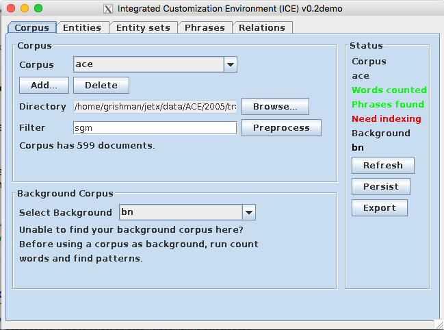
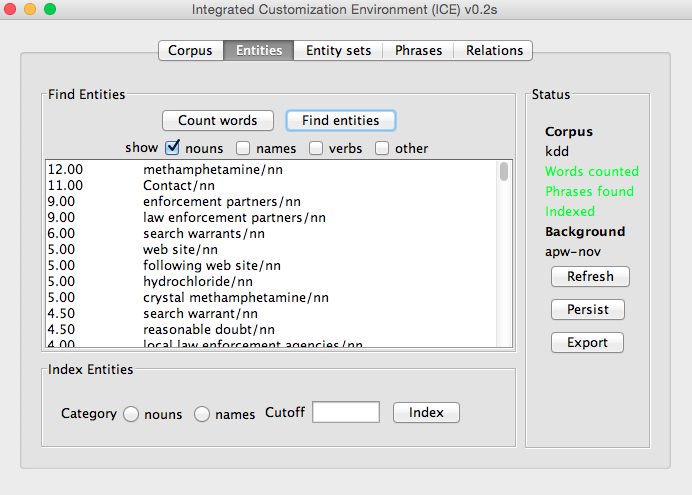
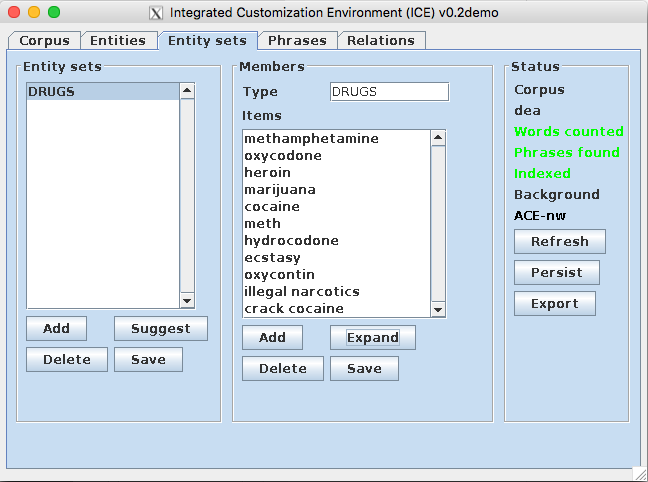
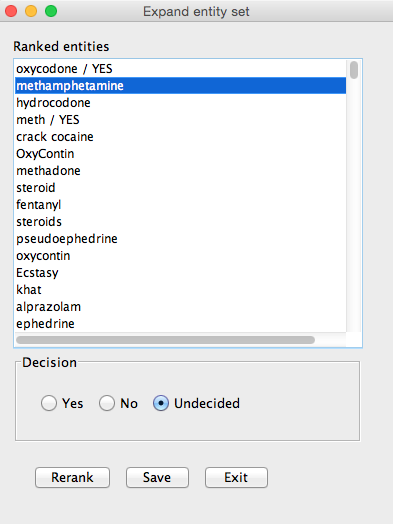
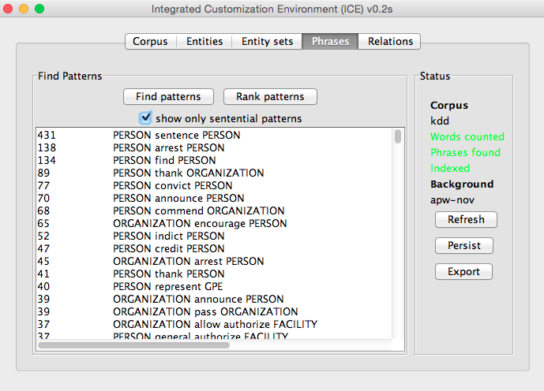
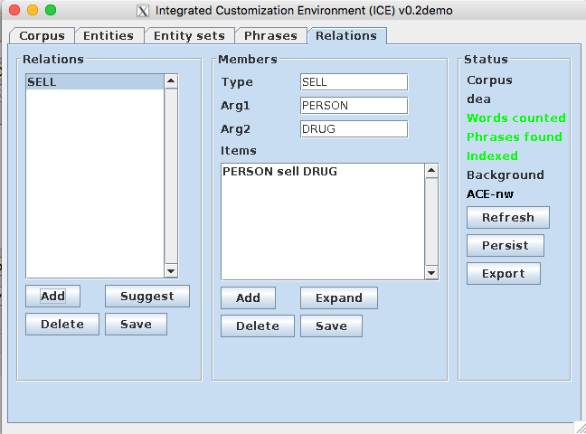
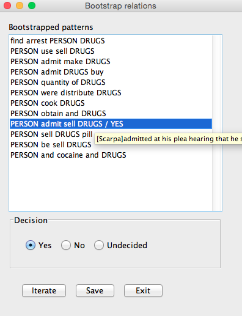

# The ICE Manual

*September 5, 2015*

## Introduction

JET is NYU's general information extraction engine, capable of extracting entities, relations and events.  It is distributed with
corpus-trained models for the ACE 2005 entity, relation, and event subtypes.  Although these types provide quite good
coverage for general news, there is a frequent need to add new types for specific domains.  In principle these could be
added by annotating all instances of the new type in the training collection.  Unless the type is very rare, this is
likely to be effective.  However, it is also likely to be quite slow and expensive.

ICE, the integrated customization environment, is intended to provide a fast but limited capability for extending JET to
new types.  It allows the user to add new entity types and relation types;  work on adding events is in progress.
Entity types are defined in terms of sets of names and common nouns; relation types are defined in terms of sets of
dependency paths (words and syntactic relations).  The user is asked to provide a few examples (typically 1 to 3) of a
new entity type, or one example of a new relation type.  The system then uses distributional analysis and bootstrapping
strategies to fill out the set, subject to user review. This approach is likely to produce much more complete sets than
if the user came up with all the set entries themselves.

We go through the steps of adding a new corpus to the system, finding entities, building new entity sets, finding a new
phrases, and building new relations. Each function can be completed in a panel of the Ice Swing GUI. Ice will bring us
to the Corpus panel when started.

ICE also provides a command line interface for possbily time-consuming tasks that do not require human intervention, so
that we can run those tasks on a server without keeping a Swing GUI. This is discussed at the end of this manual.

## Starting Ice

Unzip the package and run:

    java -Xmx4g -cp ICE-0.2.0-jar-with-dependencies.jar edu.nyu.jet.ice.controllers.Nice

or, if you have updated PATH in your shell to include JET and ICE commands, simply enter

    runice

## The Corpus Panel

__Adding a new corpus__

 A corpus is defined by a directory and a file extension.  The set of non-directory files dominated by that directory and ending in the specified extension constitute an ICE corpus.

To add a new corpus, first click *add corpus* , then either enter the path of the
root directory of the corpus or click *browse* to select the directory where the
files are located. You can apply a filter on the extension of the filename (e.g. sgm)
in the corresponding text filter;  You need to click "Preprocess" to apply the filter.

Clicking "Preprocess" will start the preprocessing process, which is rather **slow**.
This process will perform dependency parsing, name tagging, and coref resolution, and
will save the result of these steps for use by the following components.
(You may want to do this offline, as described at the end of this manual.)

__The background corpus__

Some of the corpus analysis you will perform compares the corpus you are
analyzing against a reference corpus, referred to as the *background corpus*.  
The background corpus is selected here.

__The status monitor__

The status monitor provides status information on the corpus you are
currently analyzing.  A set of red and green status messages indicate what
pre-processing steps have been performed on the corpus.  The *refresh*
button updates these messages.

Two more buttons complete this panel.  The *persist* button saves the
current status of ICE, including the corpus that you worked on, as well
as extracted entity sets and relations.  The *export* button saves the
information on entity sets and relations in a format that can be loaded
into Jet.

## Finding entities

The first step in analyzing the corpus is to identify the salient terms --
those which occur more frequently in this corpus than in a 'background
corpus'.  This is done on the entities panel using the
*find terms* button.  The result will be a list of terms
ranked by their relative frequency in the two corpora (those with the
highest frequency appearing first).

Note that you can also index entities in this panel. This is necessary
for building entity sets. Please refer to the next section for more information.

## Entity sets

__Basic approach__

You may have some prior notion from the domain of the texts or from
the analysis task as to what entity sets should be added.  Alternatively,
the top ranked unassigned terms from the term finder may suggest a needed
class.  Either way, you are ready to start building a new entity class
(this is in addition to the classes {person, organization, geo-political entity,
location, facility, vehicle, weapon} predefined by ACE.

The set builder is based on distributional similarity:  Words which appear
in the same contexts (e.g., as the subject of the same set of verbs) are likely
to be semantically similar.  You start the process by giving some seeds -- typical
members of the set.  The tool then ranks the other words in the corpus based on
their similarity to the seeds.  You then mark some of these words as correct set
members or not.  After marking some words, you may rerank the term list based on
similarity to the seeds plus all the words marked correct.  After a few iterations,
you will have a substantial set of words marked as correct set members.  Finally
you save these words as the definition of a new entity set.

__Indexing__

To make the process efficient, ICE keeps an index of the words appearing
at least n times in a given context.  Before you build the first entity
set from a new corpus, you have to build this index.  Go to the *Entities*
panel, set the cutoff (minimum value of n, default = 1, we recommend n \> 3)
and select *Index*; this will take a while.

__Building a set__

You are now ready to build an entity set.  Select the *Add* button on the
left side of the *Entity Set* panel and provide a name for the entity set.
Next add at least two seeds to the set, using the *Add* button on the
right side, under "Members". Click *Suggest* if you want Ice to suggest
seeds for you. (Multiple clicks on *Suggest* will cycle through the terms in the corpus.)

Once you have entered your seeds, select *Expand*.  ICE will compute
similarities as described above and display a list of terms, ranked
by their similarity to the seeds. You mark items as correct or
incorrect, rerank if you want, and select *save* when satisfied with the set.

In Figure 2, you can judge whether a displayed word in the ranked list belongs
to an entity set or not. To choose among Yes, No Undecided, use the radio button
or keyboard shortcuts (Y for Yes, N for No and U for undecided). If
Yes or No is chosen for an entity, the decision will be shown next to the entity.
After several entities are judged, click *Rerank* to rerank the list using the
information you just provided. When finished, click *Save* and *Exit*.

After returning to the Entity Sets panel, click the *Save* button on the right of
 the entity set panel and then the *Save* button on the left of the entity set panel
 to keep it in the Ice environment.

Finally, click *Persist* in the status panel to save the newly-built entities set to
the ice.yml file, so that these entities will be available after Ice is closed and
 re-opened. Click *Export* to export all entity sets in the ice.yml file to Jet.

## Finding Phrases

There is an analogous process for defining new types of relations and events:  you first find the
most salient patterns in a corpus and then use ICE to create clusters of these patterns.

A pattern is a sequence of words connecting two entities of specified types. (Actually, internally a pattern also
specifies the grammatical relation between these words, but this level of detail is hidden from the user.)  Because the
pattern must connect two entities, defining new entity types can lead to new patterns connecting these entities.

To find the most patterns that are most specific to a domain, use the *All phrases* or the *Sentential phrases*
button on this panel. (If *Sentential patterns* is selected, only patterns of the subject - verb - object form
are displayed.  This is useful for finding events.)
This will rank the patterns based on the ratio between their frequency in the current
corpus and their frequency in the background corpus. This is similar to what the *Find entities*
button does for entities.

Finding all patterns can be aa slow process if the corpora are large. This needs to be redone only when the
entity sets change. To save time, ICE saves the most recently
computed set of patterns and asks whether it is OK to display this older set.

## Building Relations

Building relations is just like building entity sets.  Select the *Add* button on the
left side of the *Relations* panel and provide a name for the relation.
Next add at least one seed to the set, using the *Add* button on the
right side, under "Members". Click *Suggest* if you want Ice to suggest a seed pattern
for you. (Repeatedly clicking *Suggest* will cycle through the patterns extracted
from the corpus.)

Note that the seeds you provide must be patterns extracted from the corpus.  For a
relation these patterns include the entity types of the two arguments of the
relation, as well as the base forms of the words in between.  If you enter
a seed not in the corpus, ICE will find the most similar valid seed and
present it to you for your approval or rejection.

Once you have entered your seeds, select *Expand*.  ICE will bootstrap
patterns that distribute similarly to your seed pattern. You mark items as correct or
incorrect, rerank if you want, and select save when satisfied with extracted
phrases.

Like building entity sets, you can choose whether you want to accept or reject a pattern
 using radio buttons or keyboard shortcuts. You could click *Iterate* to search for more
 patterns using the pattens you just approved. When finished, click *Save* and exit. If you
 are uncertain about what a pattern phrase means, hover your mouse over the phrase, and
 a tooltip will appear, which shows the sentence from which the pattern phrase is extracted.

 After returning to the Relations panel, click the *Save* button on the right of
  the entity set panel and then the *Save* button on the left of the entity set panel
  to keep it in the Ice environment.

 Finally, click *Persist* in the status panel to save the newly-built entities set to
 the ice.yml file, so that these entities will be available after Ice is closed and
  re-opened. Click *Export* to export all entity sets in the ice.yml file to Jet.

  __Indexed relation arguments__

A relation expresses a relationship between two arguments.  If these arguments
are of different types, there is no ambiguity in how they correspond to
elements in a pattern.  But there is an ambiguity if the two arguments are
of the same type.  Suppose we wanted to define a *child* relation in which the
first argument is the parent and the second argument is the child.  Consider
four patterns expressing this relation:

    PERSON 's son , PERSON
    PERSON 's daughter , PERSON
    PERSON 's father , PERSON
    PERSON 's mother , PERSON

In the first two patterns, the first instance of *PERSON* corresponds to the first
argument of the relation;  in the third and fourth patterns it corresponds to the
second argument.  We can specify this by

    PERSON(1) 's son , PERSON(2)
    PERSON(1) 's daughter , PERSON(2)
    PERSON(2) 's father , PERSON(1)
    PERSON(2) 's mother , PERSON(1)

## ICECLI: The Command Line Interface

ICE also provides a command line interface for actions that do not require human intervention.
This can be called in the following command:

    icecli ACTION CORPUS [OPTIONS]

### The _addCorpus_ action

This action adds a new corpus to the ICE system and preprocess it. It is a time-consuming action.
To run this action, the directory of the new corpus and the desired file extension needs to be specified
in options. We recommend setting the background corpus too, unless this is the first corpus in ICE.

The following command creates a new corpus called deaatl, from txt files in the corpus/dea_processed/atl directory,
and use apw-nov (which already exists in ICE) as background.

    icecli addCorpus deaatl --inputDir corpus/dea_processed/atl --filter txt --background apw-nov

### Parallel _addCorpus_ action

When processing very large corpus on a server with abundant memory, it is possible to spawn multiple
processes using the --processes option. It will start multiple icecli script to process input data
in parallel. By default, each icecli script requires 4GB of memory.

The following command creates a new corpus called deaatl, from txt files in the corpus/dea_processed/atl
directory using apw-nov (which already exists in ICE) as background with 8 parallel processes.

    icecli addCorpus deaatl --inputDir corpus/dea_processed/atl --filter txt --background apw-nov --processes 8

### The _mergeCorporaInto_ action

This action allows us build a large corpus from several small processes corpora. All corpora should have
the same filter (file extension). This action only works for Java 7+.

The following command merges 3 corpora apw, afp, and xin into a large corpus, which we call "three". Symlinks
to all source files will be created in the threeDir/ directory.

     icecli mergeCorporaInto three --targeDir threeDir --filter sgm --fromCorpora apw,afp,xin

### The _setBackgroundFor_ action

This action set the background corpus of a given corpus in ICE. The following command set the background corpus
of deaatl to be apw-nov.

    icecli setBackgroundFor deaatl --background apw-nov

### The _findEntities_ action

This command generates the entity list for the corpus deaatl. For this command to work, background corpus should
be properly set first. The following command finds entities (domain-specific noun groups) in deaatl.

    icecli findEntities deaatl

### The _indexEntities_ action

This command index entities in a given corpus. findEntities should be run at least once before this command can run
successfully. We have the opportunity to set the cutoff here. With a higher cutoff, a smaller portion of more specific
terms will be kept in the index. If the cutoff is not set, it defaults to 3.0.

The following command indexes entities in deaatl, and sets cutoff to 4.0.

    icecli indexEntities deaatl --entityIndexCutoff 4.0

### The _findPhrases_ action

This command extract phrases (dependency paths) in a given corpus. If a background corpus is given in the ICE configuration,
it will also generate a pattern ratio file, which contains a list of phrases ranked by their domain-specialty. The following
command extracts phrases from deaatl.  

    icecli findPhrases deaatl

### Multiple branches

Consider the situation where you have multiple small corpora which you would like to preprocess
in parallel and then combine.  By default ICE and IceCLI read from and update a file *ice.yml*,
so running multiple copies of IceCLI in parallel would not work.  The *branch* prameter
changes the file name to *branch*.yml, so multiple copies of IceCLI can be run in parallel
with different values of *branch*.  These can then be combined by an *import* action
with a *fromBranch* parameter followed by a *mergeCorporaInto* action.
